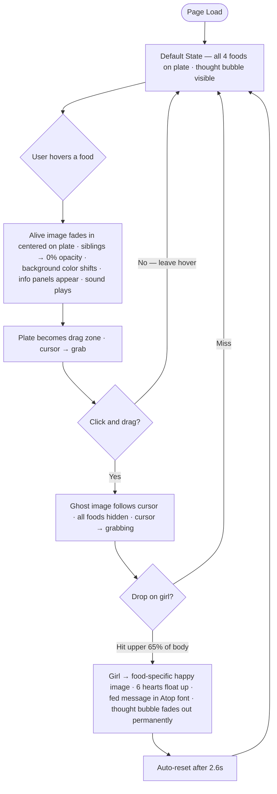

# Hero Faction Screen
**AI 201 — Project 1 | SCAD Spring 2026**

Live URL: https://euginahan.github.io/HeroFaction_Claude/

---

## Design Intent

**Originally written before AI engagement — Session 2, Wed March 25, 2026**
*Updated to reflect final implementation — Session 5, April 6, 2026*

### Concept
A playful, educational food world designed for young children (ages 5–7). The experience centers around a child interacting with different food characters, each representing a "faction" of nutrition (healthy vs. treat foods). The world feels bright, friendly, and slightly animated — like a children's learning app or interactive storybook.

**Mood:** A bright, playful, and friendly interactive experience that teaches kids about food in a fun, positive, and visually engaging way.

---

### Characters (4 Foods)

| Character | Role | Fun Fact | Recommendation | Fed Message |
|-----------|------|----------|----------------|-------------|
| Apple | Healthy / energy / strong body | "Gives you energy to play!" | "Great anytime snack!" | "An apple a day!" |
| Broccoli | Healthy / growth / vitamins | "Helps you grow strong!" | "Eat often to stay healthy!" | "Broccoli makes you strong!" |
| Chips | Treat / occasional food | "Crunchy and yummy!" | "Enjoy sometimes!" | "A crunchy treat!" |
| Ice Cream | Treat / fun but not everyday | "Sweet and fun!" | "A treat, not every day!" | "A sweet treat!" |

---

### Default State

No food is pre-selected at load. The scene is calm and inviting — storybook-like.

**Background:**
- `kitchen.jpg` — a warm, cozy kitchen photograph provided as a background asset, set as the scene's full-viewport background image
- A color overlay (`mix-blend-mode: soft-light`) sits above it and shifts to each food's highlight color on hover, tinting the kitchen environment without obscuring it

**Child character:** A seated girl illustration with black hair in pigtails, bow, and pink shirt — polished soft-3D/cartoon style. Provided as a PNG with transparent background (`girl.png`). Positioned center-stage, anchored at `bottom: 0` so she sits on the same floor plane as the table. A warm drop-shadow is applied via CSS (`filter: drop-shadow`) to match the kitchen's right-side lighting.

**Table:**
- CSS-built wooden surface with a warm brown gradient and 12° perspective tilt
- A circular plate centered in front of the child — white radial-gradient disc with off-white ring
- Fork + knife (🍴) on the left, spoon (🥄) on the right — both at 64px, proportional to the plate
- 4 food characters arranged in a 2×2 grid with per-food rotation and nudge offsets

**Bench:**
- CSS-built wooden bench visible behind the table, same warm gradient family and perspective tilt
- Layered so it appears behind the table but in front of the background, grounding the girl in the scene

---

### Layout

**Scene:** Kitchen photograph as background. A `.stage` container (`min(700px, 92vw)` wide, `88vh` tall) acts as a shared absolute-positioning context. The girl, bench, and table all anchor at `bottom: 0` — sharing one floor plane without flex margin hacks.

**Z-index stack (back to front):**
- Kitchen background (0) → color overlay (1) → bench (5) → girl (6) → table (7) → info panels (10) → thought bubble (12) → drag ghost (200)

**Food arrangement:** 2×2 CSS grid on the plate. Each food has a `rotation` value and optional `nudgeX`/`nudgeY` offsets defined in `foods.js` for organic, non-rigid placement.

---

### Color Palettes

**Apple**
- Primary: `#F46F6F`
- Highlight: `#FFD4CE`
- Shadow: `#BD3E44`
- Accent: `#440000`
- Glow: `#FF8281`

**Broccoli**
- Primary: `#50A846`
- Highlight: `#C8EAC6`
- Shadow: `#006702`
- Accent: `#004800`
- Glow: `#7BC67A`

**Chips**
- Primary: `#E5E16A`
- Highlight: `#FFF8C0`
- Shadow: `#F88F70`
- Accent: `#BB5B3F`
- Glow: `#F0ED8A`

**Ice Cream**
- Primary: `#D5AEE4`
- Highlight: `#F5E6FF`
- Shadow: `#FFB0BB`
- Accent: `#FFBF96`
- Glow: `#E8D0F5`

---

### Typography

**Headers / Food Names:** Atop — custom local typeface, bold and playful, child-friendly character
- Default size: 88px
- Exception: Broccoli food name rendered at 77px (87.5%) — the longer fed phrase required slight scaling for visual balance
- Loaded locally via `@font-face` from `src/assets/Atop.ttf` — no external dependency
- Styled as a **sticker/outline**: thick white stroke (~10px) follows each letter's exact contour using `paint-order: stroke fill`. Stroke paints behind fill so inner color stays clean. Subtle drop-shadow adds depth.
- Text is treated as a visual object — integrated into the illustrated scene, not a flat overlay.

**Note labels (Fun Fact / Remember):** Atop at 17px — consistent with header family at smaller scale

**Body / Fun Facts + Recommendations:** BC Civitas (Briefcase Type) — clean, readable, slightly softer serif
- Size: 19px
- Loaded via Adobe Fonts kit in `index.html`

**Onboarding bubble text:** BC Civitas at 17px, color `#222`

_Typography rationale: treating headers as sticker-style visual objects rather than flat text improves readability against complex illustrated backgrounds while reinforcing the playful, character-driven aesthetic._

---

### Onboarding Hint

A thought bubble appears on initial load, positioned to the upper right of the girl's head.

**Structure:**
- Main cloud: inline SVG — 10 overlapping circles merged via `feGaussianBlur` + `feColorMatrix` alpha threshold into one clean irregular cloud shape. No stroke — defined by layered CSS `drop-shadow`.
- Text inside cloud: *"Pick a food and feed it to me!"* in BC Civitas, 17px, `#222`
- 3 connector circles trail in a gentle diagonal arc from the cloud base toward the girl's head, decreasing in size (r=14 → 11 → 8) with increasing horizontal offset

**Animation:**
- Each connector circle pulses independently (staggered 0 / 0.25 / 0.5s, 1.3s loop, `ease-in-out`)
- Opacity depth: closest to bubble 100%, middle 85%, closest to head 70%
- Entire bubble fades out permanently after the first successful drag-and-feed

---

### Hover Behavior

**Transition timing:** 400–500ms, `ease-out`. Background overlay shift ~500ms. Nothing abrupt.

When a food is hovered:
- Background shifts to the food's highlight color via the soft-light overlay
- Info panels fade in at 450ms `ease-out`:
  - Top center → Food name (Atop sticker style, food's primary color)
  - Left → Fun Fact (cream paper note card, tape strip, slight counter-clockwise rotation)
  - Right → Recommendation (pink paper note card, torn bottom edge, slight clockwise rotation)
- Sound plays on hover start (Web Audio API — no audio files):
  - Apple → soft crunch
  - Broccoli → light pop/boing
  - Chips → crispy crunch
  - Ice Cream → soft playful chime

**All 4 foods use the image-based interaction system (fully implemented):**
- Idle: static PNG in its 2×2 grid cell
- On hover:
  - 75ms debounce prevents flicker from cursor jitter
  - 250ms crossfade from static → animated "alive" PNG
  - Alive character lifts out of grid, centers on plate via `position: absolute` overlay
  - Wave + bounce CSS animation plays 2 loops on the alive character
  - Glow `drop-shadow` in the food's color
  - All other foods fade to 0% opacity (fully hidden)
- On hover-out:
  - 250ms crossfade back to static PNG
  - Other foods return to full opacity
  - Food returns to grid cell

_Assets used exactly as provided — no restyle or redraw. Only CSS animation applied._

---

### Drag & Feed Interaction

Built on top of hover. Available for all 4 foods.

**Trigger:** After hovering a food (alive state), the plate becomes a drag zone. Click and drag picks up the alive character.

**Drag behavior:**
- Ghost image of the alive character follows the cursor (`position: fixed`, centered on cursor)
- Ghost sways gently (CSS `alternate` keyframe animation)
- All plate foods remain hidden during drag
- Cursor changes to `grabbing`

**Drop zone:** Girl's upper body / head area — top 65% of her bounding box, detected via `getBoundingClientRect()`

**On successful drop:**
- Ghost fades out
- Girl crossfades to her food-specific happy illustration
- 6 hearts float and fade above her head (staggered timing, `heart-float` keyframe)
- Fed message pops in with spring animation (Atop sticker style, food's primary color)
- Info panels fade out
- Thought bubble fades out permanently (first feed only)

**Auto-reset:** After 2.6 seconds, all state returns to default

**Per-food assets (all complete):**
- `girl-happy-apple.png` / `girl-happy-broccoli.png` / `girl-happy-chips.png` / `girl-happy-icecream.png`

---

### What I Will Not Compromise On

1. The tone must always feel **safe, positive, and fun** for children.
2. Nothing should feel scary, harsh, overly complex, or boring.
3. The experience must feel like a **playful story or game**, not a lecture.

---

## Mermaid Diagram

---

## AI Direction Log

**Entry 7 — Thought bubble onboarding system (Session 5, April 6, 2026)**
- **Asked:** Add an onboarding hint bubble near the girl's head. Went through multiple rounds: first a CSS rounded cloud, then using the provided hand-drawn PNG asset, then a full SVG rebuild from circles using a blob-merge filter, then iterative refinements to position, size, stroke weight, connector circle spacing, arc shape, and opacity depth.
- **Produced:** Inline SVG component (`ThoughtBubble.jsx`) — 10 overlapping circles merged via `feGaussianBlur` + `feColorMatrix` threshold filter into a single clean cloud shape. Three connector circles trail in a diagonal arc toward the girl's head with staggered pulse animation and depth opacity (70/85/100%). BC Civitas text centered in cloud. Fades out permanently after first successful feed.
- **Kept:** SVG blob-merge approach for the cloud shape, separate keyframe animations per connector dot for opacity variation, `hasInteracted` state to control visibility.
- **Note:** This section required the most iteration of any feature — see Records of Resistance.

**Entry 6 — UI polish: utensils, alive food calibration, header scaling (Session 5, April 6, 2026)**
- **Asked:** Scale up utensils proportionally to the plate. Calibrate alive broccoli, chips, and ice cream to match the apple's visual presence. Reduce the broccoli fed-message header size slightly.
- **Produced:** Utensils scaled from 28px → 64px. Per-food `nameFontSize` field added to `foods.js` and passed through `InfoPanel` for per-food text overrides. Alive overlay sizes increased ~133% for broccoli/chips/ice cream to compensate for extra transparent padding in those PNGs. Drag ghost sizes updated to match.
- **Kept:** All values data-driven through `foods.js` — no hardcoded one-off overrides in components.

**Entry 5 — Drag-and-feed interaction + all 4 foods complete (Session 5, April 6, 2026)**
- **Asked:** Implement drag-and-feed for all foods. On hover, the plate becomes a grab zone. Dragging picks up the alive character as a ghost; dropping on the girl's upper body triggers a happy reaction, hearts, and a fed message. Auto-resets after 2.6s. Also: provide happy-girl assets for broccoli, chips, and ice cream to complete the full interaction loop.
- **Produced:** Window-level `mousemove`/`mouseup` listeners track drag position. Drop detection uses `getBoundingClientRect()` on the girl image — checks if cursor lands in the upper 65% of her bounding box. `fedState` drives girl image swap, heart animation, and fed message. `girlHappyImg` and `fedMessage` fields added to all 4 food data entries.
- **Kept:** Hover lock during drag (drag state blocks `handleLeave`). Auto-reset via `setTimeout`. Clean separation between hover, drag, and fed states.

**Entry 4 — Food asset roll-out: Broccoli → Chips → Ice Cream (April 2–5, 2026)**
- **Asked:** Add image assets for the remaining three foods one at a time as PNGs were provided. Each food needed its own size tuning — broccoli's alive overlay needed explicit upscaling immediately after introduction. Chips assets replaced a first-pass fries set entirely when the correct chip bag illustration arrived. Ice cream's first transparent-background PNG replaced an earlier version with a white fill.
- **Produced:** Each food received `staticImg` + `animatedImg` fields in `foods.js`. Per-food `.alive-{id}` CSS overrides set correct overlay sizes accounting for different canvas padding in each PNG. The hybrid system introduced in Entry 2 (image path vs emoji path) handled all four foods without structural changes.
- **Kept:** One food added at a time, matching the design intent's incremental rollout plan. Nudge offsets (`nudgeX`/`nudgeY`) added for chips and ice cream to center them visually on the plate.

**Entry 3 — Girl asset introduction + scene grounding (Session 4, April 1, 2026)**
- **Asked:** Replace the CSS geometric child placeholder with the provided illustrated girl PNG. Then replace the CSS-drawn room with a kitchen background photo. Recomposite the scene so the girl, bench, and table all share the same floor plane and feel grounded — not floating.
- **Produced:** Six iterative commits to resolve the girl's placement: initial PNG swap → scale adjustment → chair-back removal → kitchen background introduction → perspective tilt on table/bench → bench addition → full layout rearchitecture. Final solution: `.stage` as a shared absolute-positioning context, all three elements (girl, bench, table) anchored at `bottom: 0` so they share a common floor plane. `z-index` layering: bench (5) behind table (7) behind girl (6) at front, producing a natural depth stack.
- **Kept:** Absolute stage approach, `bottom: 0` floor anchoring, warm drop-shadow on girl for right-side kitchen light.
- **Note:** The girl's floating issue required a full layout rearchitecture, not a simple position fix — the flex-based layout couldn't express a shared floor plane.

**Entry 2 — Apple image assets + image-food system (Session 4, April 1, 2026)**
- **Asked:** Replace emoji apple with provided static + animated PNGs. Crossfade 250ms, center alive apple on plate at 1.25× scale on hover, hide all siblings to 0%, wave+bounce animation 2 loops, crunch sound.
- **Produced:** Data-driven hybrid system — `FoodItem` reads `staticImg`/`animatedImg` fields and switches between image-crossfade path and emoji+face path. Alive apple uses `position: absolute` centered on `.plate-inner` (the positioning reference) to break out of the 2×2 grid on hover. Wave animation applied to the image, centering to the wrapper.
- **Kept:** 250ms crossfade, 1.25× scale, full 0% opacity hide for siblings, 2-loop wave+bounce, crunch on hover.
- **Note:** Foods are updated one at a time. Broccoli, Chips, Ice Cream still emoji until their assets arrive.

**Entry 1 — Initial scene and component build (Session 3, March 30, 2026)**
- **Asked:** Build the full React app structure — CSS room scene (wall, window, curtains, couch, painting), child placeholder figure, table with plate, 2×2 food grid, hover interactions (scale, fade, face animation, background shift), info panels (top/left/right), and Web Audio API sounds for all 4 foods.
- **Produced:** Complete working app matching the Design Intent layout. Background color transitions on hover, food scaling/fading, blinking face animation, and programmatically generated sounds (no audio files needed).
- **Kept:** Overall structure, sound approach using Web Audio API, CSS-drawn room elements, component architecture (FoodItem, InfoPanel, data/foods.js, utils/sounds.js).
- **Note:** Child character is a CSS placeholder (geometric shapes). Final version should match the illustrated 3D/cartoon style described in the Design Intent.

---

## Records of Resistance

> _Documented moments where AI output was rejected or significantly revised._

**Record 1 — The girl wouldn't stay on the ground**

When I provided the illustrated girl PNG, the AI placed her correctly on screen but she looked like she was floating above the table rather than sitting at it. Scaling her up made it worse — the bench and table no longer read as the same surface she was sitting on. Multiple size adjustments didn't fix the root problem. It took six commits and a full layout rearchitecture before the scene felt grounded: the AI had to abandon the flex-based layout entirely and rebuild the positioning system so the girl, bench, and table all anchored from the same floor plane. I had to keep pushing back and pointing to the visual disconnect before it diagnosed the structural cause rather than patching symptoms.

**Record 2 — Text and font styles needed repeated correction**

The info panels showing food names, fun facts, and recommendations went through several rounds of visual rework. The first version rendered text as plain overlays with no visual treatment. I asked for improvement and got a rounded title bubble — which felt like a generic UI element, not consistent with the illustrated style. After another round I got paper note cards with a tape strip and torn edge, which matched the storybook aesthetic much better. The food name headers were then rebuilt again when the Atop font was introduced — switching from a filled text style to a sticker-outline treatment (white stroke, `paint-order: stroke fill`) so the headers read as part of the illustrated scene rather than floating labels. Each step was an improvement, but the style required persistent direction across multiple sessions before it matched the Design Intent.

**Record 3 — Food asset sizes kept being wrong**

As each food's PNG was introduced, the alive overlay size needed explicit correction. Broccoli was added at one size and immediately needed upscaling because its PNG had more transparent canvas padding than the apple — the actual food content was smaller than expected. The same issue recurred for chips and ice cream. Chips also required a full asset replacement: the first set of chip assets was a fries illustration rather than the chip bag specified in the design, and the whole set had to be swapped. Even after all four foods were in, a second calibration pass was needed to make broccoli, chips, and ice cream feel as visually present as the apple, which required increasing their overlay sizes by ~133%.

**Record 4 — Thought bubble approach rejected twice**

The first thought bubble was a CSS rounded rectangle with `border-radius: 50px`. I rejected it immediately — the prompt said cloud shape, not a pill button. The AI rebuilt it as an SVG using a blob-merge filter from overlapping circles, which was the right approach. Then I provided a hand-drawn PNG asset and asked it to use that instead. The AI used the PNG as the bubble image and tried to layer animated CSS circles on top of the drawn circles in the asset. I reverted this version immediately — the mismatch between the flat illustration and CSS animation overlays felt visually inconsistent, and the drawn circles in the PNG couldn't be animated independently. We returned to the SVG-built version and continued refining from there.

**Record 5 — Connector circles took four rounds to feel natural**

The three small connector circles trailing from the thought bubble toward the girl's head went through four explicit revision rounds. The first version had them spaced evenly in a straight vertical line. The second reduced their size but kept the mechanical spacing. The third introduced a curved arc but the positions still felt too calculated — the user gave exact pixel coordinates for where each circle should land. Even then, a fourth round adjusted the diagonal angle and equalized the spacing. The core problem was that the AI defaulted to geometrically regular arrangements whenever given a layout task, and "organic" required explicit overrides of every variable: x offset, y gap, size, opacity, and arc angle, all specified by hand.

---

## Five Questions Reflection

> _Short paragraph answering: Can I defend this? Is this mine? Did I verify? Would I teach this? Is my documentation honest?_
